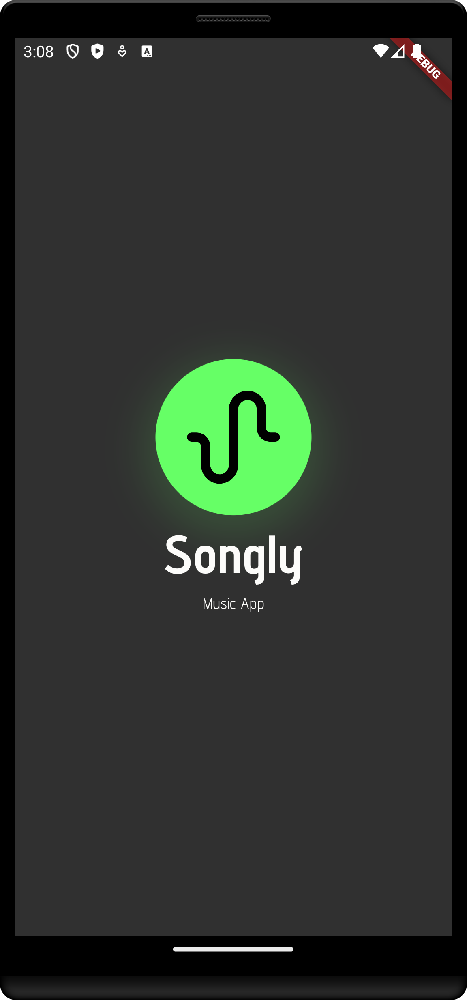
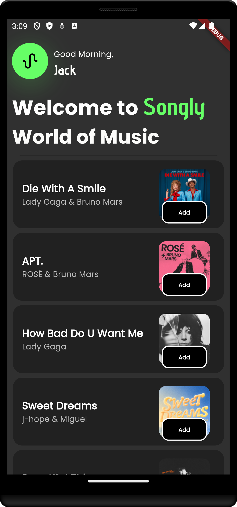
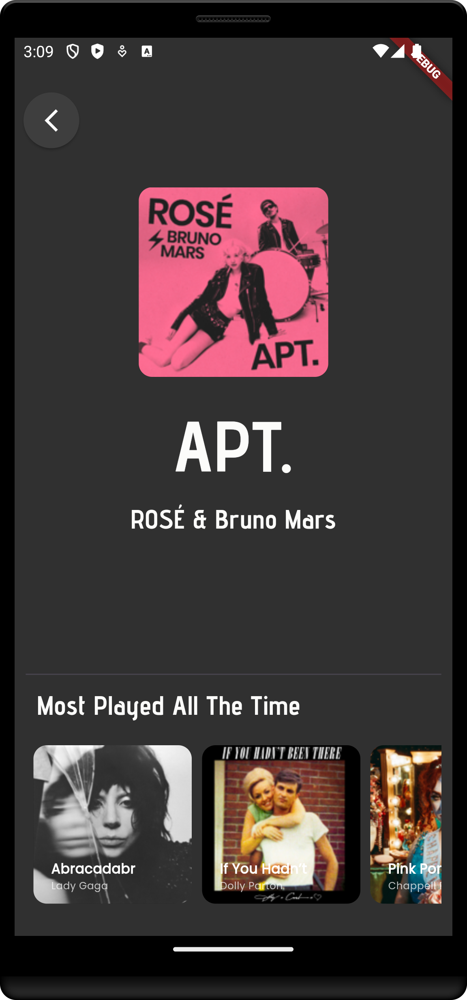
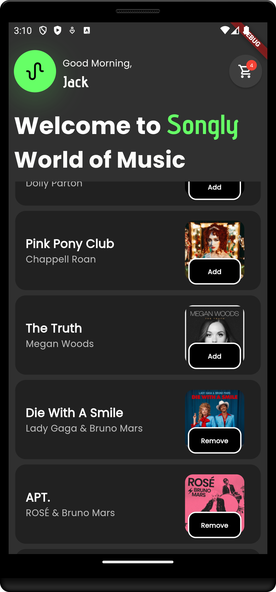
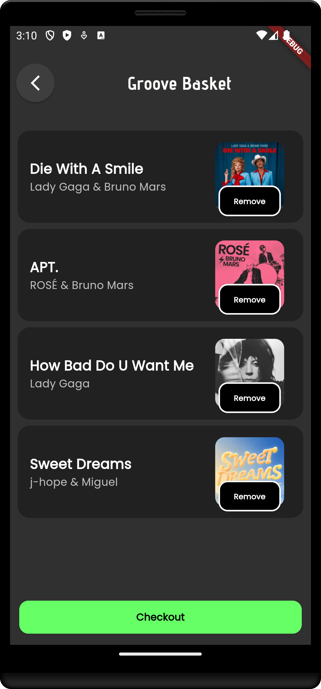
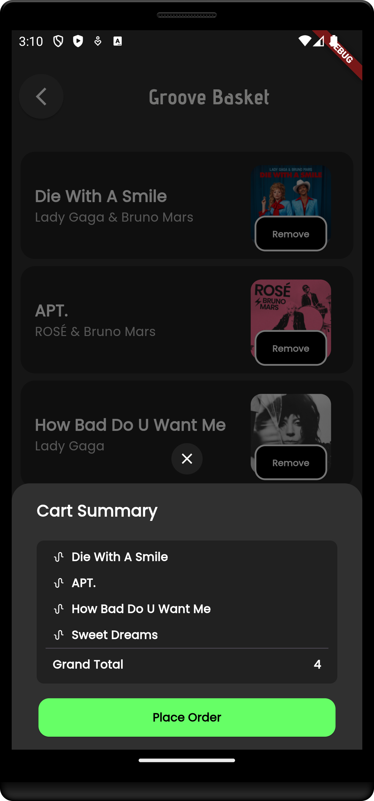

# Songly - Music Lovers App

Songly is an all-in-one application for music enthusiasts. It offers a complete experience with product listing, product cart, checkout, and detailed product information—all designed for music lovers.

## Features

- **Product Listing:** Browse a wide variety of music products.
- **Product Cart & Checkout:** Easily add products to your cart and complete purchases.
- **Product Details:** View comprehensive details for each product.
- **Data Caching:** Loads products from the network initially, then caches them locally for faster subsequent access.
- **Force Refresh:** Pull-to-refresh functionality to manually update product listings.
- **Advanced Navigation:** Uses AutoRoute for flexible and intuitive routing.
- **State Management:** Follows the MVVM & Clean Architecture patterns using Bloc Cubit.
- **Dependency Injection:** Uses Injectable with GetIt for service location and dependency management.
- **Multi-Module App:** Organized as a multi-module app leveraging a monorepo setup managed by Melos.

## Architecture & Modules

| Module                                                | Description                                                                                                                                             |
|-------------------------------------------------------|---------------------------------------------------------------------------------------------------------------------------------------------------------|
| **app**                                               | Presentation layer containing UI components, navigation, and view logic.                                                                              |
| **data**                                              | Data layer with repository implementations and data provider contracts for products.                                                                  |
| **domain**                                            | Business logic layer defining use cases and repository contracts, containing core business rules.                                                     |
| **shared**                                            | Shared models and utilities (a lighter version of clean architecture) to reduce redundant data transformations.                                        |
| **config**                                            | Configuration module that leverages Flutter environment variables (using Dart defines and `.env` files) for secure configuration.                      |
| **dependency_injection / dependency_registry**        | Provides common dependency injection contracts and wiring of all modules through advanced annotation-based coding and code generation.                |
| **localisation**                                      | Supports multi-language functionality (currently English).                                                                                           |
| **network-retrofit**                                  | API data provider module that uses Retrofit (with Dio internally) for network calls.                                                                  |
| **database-realm**                                    | Local storage module using Realm, a NoSQL database for caching data.                                                                                    |

## Screenshots

Below are some screenshots showcasing the app's features:

| Screenshot 1                                      | Screenshot 2                                      | Screenshot 3                                      |
|---------------------------------------------------|---------------------------------------------------|---------------------------------------------------|
|           |           |           |

| Screenshot 4                                      | Screenshot 5                                      | Screenshot 6                                      |
|---------------------------------------------------|---------------------------------------------------|---------------------------------------------------|
|           |           |           |


## Technology Stack

- **Flutter:** UI framework for building cross-platform applications.
- **Bloc/Cubit:** For state management, following MVVM & Clean Architecture principles.
- **AutoRoute:** For advanced navigation and routing.
- **Injectable & GetIt:** For dependency injection and service location.
- **Dio & Retrofit:** For making network API calls.
- **Realm:** For local data caching.
- **Melos:** For managing a multi-module monorepo.

## Project Structure

music-lovers-app/
├── app                # Presentation layer (UI, Navigation, etc.)
├── data               # Data layer (Repositories, Data Providers)
├── domain             # Business Logic (Use Cases, Repository Contracts)
├── shared             # Shared Models and Utilities
├── config             # Environment configuration using Flutter env variables
├── dependency_injection & dependency_registry  # DI setup and module wiring
├── localisation       # Multi-language support
├── network-retrofit   # API Data Provider using Retrofit/Dio
├── database-realm     # Local NoSQL database using Realm

## Test Cases

The project includes a comprehensive suite of tests to ensure the reliability and consistency of the application. The tests are organized into three main categories:

### Data Layer Tests
- **Repository Tests:**  
  Verify that data is correctly fetched from the network and cached locally. These tests cover:
    - Successful data retrieval from both remote and local sources.
    - Handling error scenarios when fetching data.
    - Ensuring that caching mechanisms work as expected.

- **API Provider & Local Storage Tests:**  
  Validate that the API providers and local database (Realm) components correctly parse and store data.

### Domain Layer Tests
- **Use Case Tests:**  
  Test the business logic and repository contracts defined in the domain module. For example:
    - Verifying that the `FetchTrendingSongsUseCase` correctly calls the repository with the appropriate parameters.
    - Ensuring that parameter validation (e.g., verifying positive limits) behaves correctly.

### UI & Golden Tests
- **Widget Tests:**  
  These tests confirm that the UI components (such as buttons, list items, and dashboards) behave correctly:
    - Correct rendering of text and icons.
    - Proper response to user interactions (e.g., tapping a button).

- **Golden Tests:**  
  Golden tests perform visual regression testing by comparing the rendered output of UI components against pre-approved "golden" images. Key golden tests include:
    - Rendering of the `AppButton` and `CartButton` in different themes and states.
    - Ensuring that any visual changes are intentional.  
      To run the golden tests and update the images if needed, use:
  ```bash
  flutter test --update-goldens

## Navigation & Dependency Injection
# Navigation:
The app uses AutoRoute for managing navigation between pages.

# Dependency Injection:
Uses Injectable (backed by GetIt) to manage dependencies across modules. Each module has its own DI configuration.

## Contributing
Contributions are welcome! Please open an issue or submit a pull request with your improvements or bug fixes.

